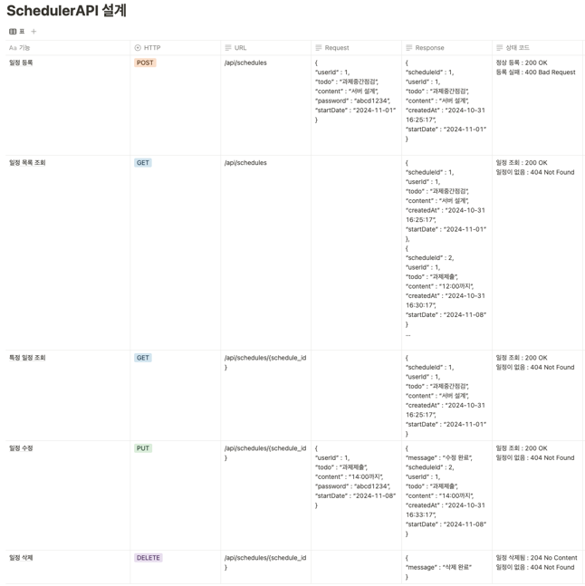
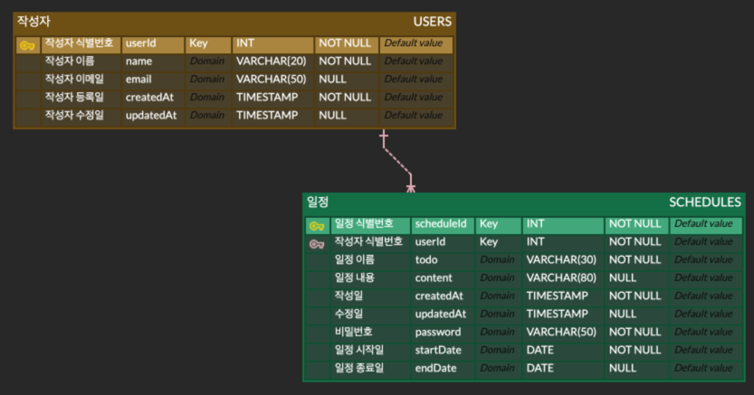

# HW3.SchedulerAPI

## API 명세서

### Request

### Response

## ERD 설계

- 비밀번호는 일정(Schedule) 수정에 대한 인증을 위해 사용되므로 작성자 테이블에 포함 X

- 작성자 테이블의 기본 키가 일정 테이블의 외래 키로 사용된다. 작성자와 일정은 각각 독립적으로 존재 가능하므로 비식별 관계로 정의