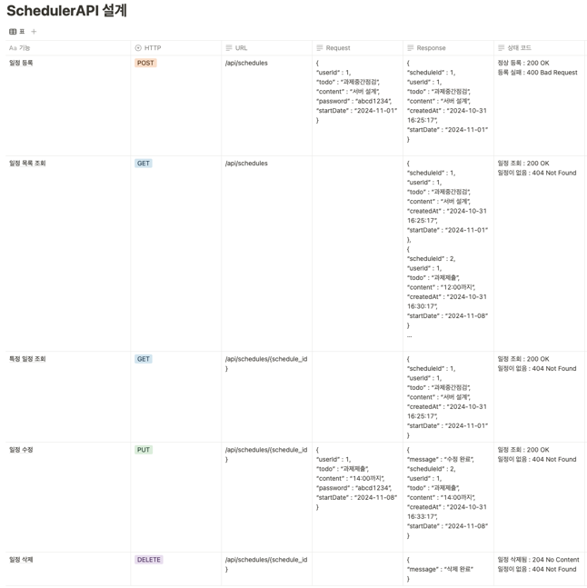
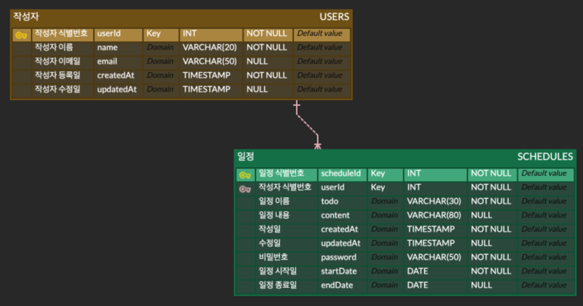

# HW3.SchedulerAPI

## API 명세서



### 1. ```POST``` 일정 등록   
> #### Request  ```/api/schedules```

|Parameter|Type|Required| Description |   
|---------|----|--------|------------|
|userId|INT|O| 작성자 id     |
|todo|VARCHAR(30)|O| 일정명        |
|content|VARCHAR(80)|X| 일정 내용      |
|password|VARCHAR(50)|O|일정 비밀번호|
|startDate|DATE|O|일정 타겟 날짜|
|endDate|DATE|X|기간이 있을 경우 마감 날짜|

> #### Response```HTTP/1.1 200 OK```

|Parameter|Type|Required| Description |   
|---------|----|--------|------------|
|scheduleId|INT|O|일정 id|
|userId|INT|O| 작성자 id     |
|todo|VARCHAR(30)|O| 일정명        |
|content|VARCHAR(80)|X| 일정 내용      |
|password|VARCHAR(50)|O|일정 비밀번호|
|createdAt|TIMESTAMP|O|작성일|
|startDate|DATE|O|일정 타겟 날짜|
|endDate|DATE|X|기간이 있을 경우 마감 날짜|

### 2.```PUT``` 일정 수정 
> #### Request ```/api/schedules/{scheduleId}```

|Parameter|Type|Required| Description |   
|---------|----|--------|------------|
|userId|INT|O| 작성자 id     |
|todo|VARCHAR(30)|O| 일정명        |
|content|VARCHAR(80)|X| 일정 내용      |
|password|VARCHAR(50)|O|일정 비밀번호|
|startDate|DATE|O|일정 타겟 날짜|
|endDate|DATE|X|기간이 있을 경우 마감 날짜|

> #### Response ```/api/schedules/{scheduleId}```

|Parameter|Type|Required| Description |   
|---------|----|--------|------------|
|scheduleId|INT|O|일정 id|
|userId|INT|O| 작성자 id     |
|todo|VARCHAR(30)|O| 일정명        |
|content|VARCHAR(80)|X| 일정 내용      |
|password|VARCHAR(50)|O|일정 비밀번호|
|createdAt|TIMESTAMP|O|작성일|
|updatedAt|TIMESTAMP|O|수정일|
|startDate|DATE|O|일정 타겟 날짜|
|endDate|DATE|X|기간이 있을 경우 마감 날짜|

### 3.```GET``` 일정 조회
> #### Response ```/api/schedules/{scheduleId}```

|Parameter|Type| Required | Description |   
|---------|----|----------|------------|
|userId|INT| O        | 작성자 id     |
|todo|VARCHAR(30)| O        | 일정명        |
|content|VARCHAR(80)| X        | 일정 내용      |
|createdAt|TIMESTAMP| O        |작성일|
|updatedAt|TIMESTAMP| X        |수정일|
|startDate|DATE|O|일정 타겟 날짜|
|endDate|DATE|X|기간이 있을 경우 마감 날짜|


## ERD 설계


- 비밀번호는 일정(Schedule) 수정에 대한 인증을 위해 사용되므로 작성자 테이블에 포함 X

- 작성자 테이블의 기본 키가 일정 테이블의 외래 키로 사용된다. 작성자와 일정은 각각 독립적으로 존재 가능하므로 비식별 관계로 정의
